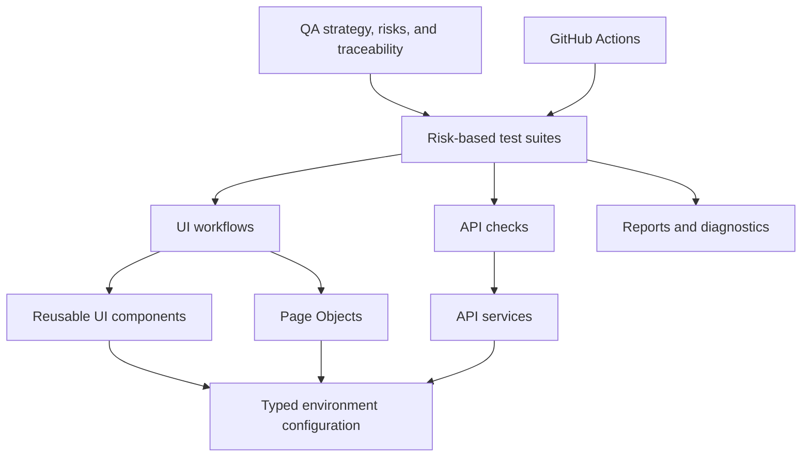

# QA Automation Portfolio

An executable quality engineering foundation for
[Automation Exercise](https://automationexercise.com), built with Playwright, TypeScript, and
Node.js. The repository prioritizes honest capability claims, risk-based coverage, deterministic
automation, and responsible use of a public third-party system.

## Current implementation

Phases 1 through 4 provide:

- strict TypeScript, ESLint flat config, and Prettier;
- typed and validated `BASE_URL` configuration with `.env` support;
- Playwright projects for API, Chromium, Firefox, and WebKit coverage;
- conservative single-worker execution with CI-only retries and failure diagnostics;
- one GitHub Actions pipeline for quality checks, API tests, and browser tests;
- a dated functional/API analysis and test-data strategy;
- a risk-based catalog of 52 designed scenarios with traceability;
- 13 automated tests using small page, API, data, and lifecycle abstractions; and
- test strategy, cycle planning, BDD, bug-reporting, automation, and AI-assistance documentation.

Current automation covers two official product API behaviors and 11 Chromium UI behaviors across
product discovery, authentication, registration/account lifecycle, and cart state. Disposable users
are unique, held in process memory, and verified absent after cleanup. Checkout, payment, contact,
review, subscription, and broad regression remain unimplemented. No generated reports are committed.

## Target architecture and roadmap

The diagram is a target, not a representation of capabilities already implemented.



| Phase                                   | Status      | Intended outcome                                                         |
| --------------------------------------- | ----------- | ------------------------------------------------------------------------ |
| 1. Foundation                           | Implemented | Tooling, configuration, CI policy, and honest QA documentation           |
| 2. Application analysis and test design | Implemented | Verified inventory, risks, 52 scenarios, traceability, API/data analysis |
| 3. Foundational automation              | Implemented | Two API and two Chromium product tests with used-only abstractions       |
| 4. Stateful automation                  | Implemented | Nine authentication, registration/account, and cart scenarios            |
| 5. Broader evidence                     | Planned     | Cross-browser regression and refined reporting based on observed risks   |

## Application analysis

The public application was inspected on 2026-09-10 using low-volume, primarily non-mutating
requests. The current design covers authentication, registration/account lifecycle, products,
search, categories, brands, recommendations, reviews, cart, checkout, practice payment/order,
contact, subscription, navigation, and the officially published API surface.

| Design evidence                    |   Current count |
| ---------------------------------- | --------------: |
| Manual test scenarios designed     |              52 |
| Critical / High / Medium / Low     | 8 / 26 / 16 / 2 |
| Automate / Manual / Consider Later |      38 / 5 / 9 |
| Planned `@smoke` / `@regression`   |          7 / 38 |
| Executable tests                   |              13 |

See [`docs/FUNCTIONAL-INVENTORY.md`](docs/FUNCTIONAL-INVENTORY.md),
[`docs/TEST-SCENARIOS.md`](docs/TEST-SCENARIOS.md), and
[`docs/API-ANALYSIS.md`](docs/API-ANALYSIS.md). Confirmed observations, official documentation,
assumptions, and open questions are kept distinct.

## Setup

Requirements: Node.js 24 and npm.

```bash
npm ci
cp .env.example .env
```

On Windows PowerShell, use `Copy-Item .env.example .env` instead of `cp`.

Browser binaries are not installed by `npm ci`. Install only the browser needed for the work, for
example `npx playwright install chromium`. API-only checks do not require a browser binary.

## Environment

| Variable   | Required | Default                          | Purpose                         |
| ---------- | -------- | -------------------------------- | ------------------------------- |
| `BASE_URL` | No       | `https://automationexercise.com` | UI and request-context base URL |

Values from `.env` are loaded locally. `BASE_URL` must be an HTTP or HTTPS URL. The official APIs
share this origin, so a duplicate `API_BASE_URL` is not needed.

## Project structure

```text
src/
  api/       Typed transport parsing plus product and account API methods used by tests
  config/    Validated environment configuration
  data/      Native synthetic-user generation
  fixtures/  Disposable-user ownership and verified cleanup
  pages/     Small page objects used by product, account, and cart tests
tests/
  api/       Official product API coverage
  ui/        Chromium-first product, user-lifecycle, and cart coverage
docs/        QA analysis, strategy, scenarios, and traceability
```

Playwright still supplies a fresh browser context per UI test. One worker-scoped disposable user is
shared only by the non-destructive valid-login, logout, and duplicate-registration scenarios; its
fixture owns verified API teardown, including retries and direct single-test execution. UI
registration and deletion scenarios own separate users and always attempt verified cleanup.

## Scripts

| Command                                   | Current behavior                                             |
| ----------------------------------------- | ------------------------------------------------------------ |
| `npm test`                                | Runs the API and Chromium foundation suites                  |
| `npm run test:ui`                         | Runs Chromium UI tests                                       |
| `npm run test:api`                        | Runs the API tests                                           |
| `npm run test:smoke`                      | Runs implemented API/Chromium scenarios tagged `@smoke`      |
| `npm run test:regression`                 | Runs implemented API/Chromium scenarios tagged `@regression` |
| `npm run test:cross-browser`              | Runs UI coverage across Chromium, Firefox, and WebKit        |
| `npm run test:headed`                     | Runs Chromium in headed mode                                 |
| `npm run test:debug`                      | Opens Playwright debugging for Chromium                      |
| `npm run test:report`                     | Opens the latest generated HTML report                       |
| `npm run lint` / `npm run lint:fix`       | Checks or fixes supported lint findings                      |
| `npm run format` / `npm run format:check` | Writes or checks Prettier formatting                         |
| `npm run typecheck`                       | Runs strict TypeScript checking without emitting files       |

Browser-oriented scripts require the corresponding local Playwright browser installation.
`test:cross-browser` explicitly runs Chromium, Firefox, and WebKit; normal local execution uses API
plus Chromium. `test:report` requires a report from a prior test run. Zero discovered tests fails in
normal and CI execution.

## CI policy

Pull requests and pushes to `main` run formatting, linting, type checking, API tests, and Chromium
UI tests. Manual `workflow_dispatch` runs the same checks plus explicit Firefox and WebKit jobs.
Artifacts use browser- and run-specific names.

There is no scheduled trigger. Cross-browser execution is manual because repeatedly exercising a
public third-party site without a change or an explicit reviewer decision would waste shared
infrastructure and create avoidable traffic. CI uses one Playwright worker; concurrency can increase
only after test data and mutable state are proven isolated.

## Ethical testing constraints

- Do not run load, stress, soak, or destructive testing against Automation Exercise.
- Use minimal data, avoid personal information, and clean up created state when the site supports it.
- Keep retries and parallelism low; investigate failures rather than masking instability.
- Respect availability, terms, rate limits, and the fact that this is externally owned infrastructure.
- Direct database access is unavailable and out of scope.

## Known limitations

- Thirteen scenarios are automated; the other 39 designed scenarios are not implemented.
- Public-site data, availability, and behavior are outside this repository's control.
- BDD artifacts are documentation only; Cucumber is not installed.
- Reporting is limited to Playwright's built-in console and HTML reporters.
- Cross-browser execution is configured but Phase 4 was validated locally only in Chromium.
- Checkout, payment/order, contact, review, subscription, and accessibility coverage remain planned
  and must be justified by implemented scenarios.

## Engineering decisions

- Capability-driven structure avoids empty folders and speculative abstractions.
- Exact dependency versions and the repository lockfile make installation reproducible.
- One worker reduces interference with shared mutable state.
- Native UUID-based synthetic users avoid static credentials and third-party data generators.
- Account teardown verifies absence and preserves both test and cleanup failures when both occur.
- Runtime product selection and isolated browser contexts avoid shared or hard-coded cart state.
- Failure-only screenshots/videos and first-retry traces balance evidence with storage.
- `BASE_URL` is centralized and validated without introducing unused schema tooling.
- AI may assist analysis or drafting, but accountable human review is mandatory.
